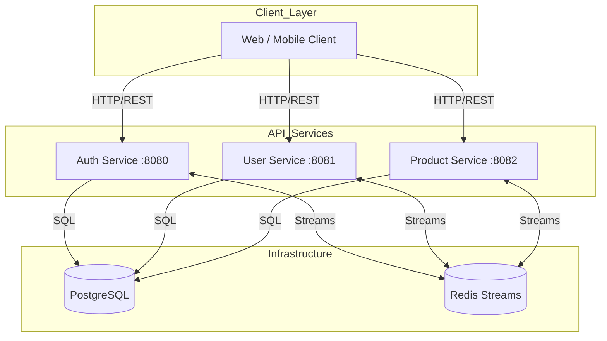
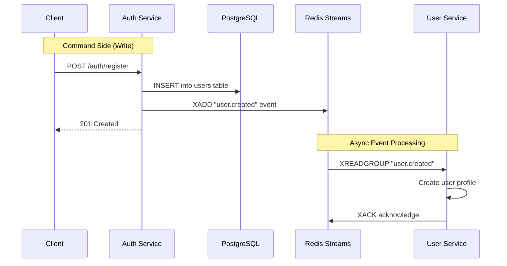

# Go Microservices with Redis Pub/Sub Boilerplate


A production-ready, high-performance microservices starter kit. Built with **Go 1.23+**, **Gin** web framework, **GORM** (PostgreSQL ORM), and **Redis Streams** for event-driven communication.

This boilerplate implements the **Clean Architecture** pattern with strict layer separation (delivery → usecase → repository → domain), and uses **Redis Streams** for asynchronous inter-service communication.

---

## Table of Contents

- [Features](#-features)
- [System Architecture](#-system-architecture)
- [Project Structure](#-project-structure)
- [Prerequisites](#-prerequisites)
- [Getting Started](#-getting-started)
  - [1. Clone & Install](#1-clone--install)
  - [2. Environment Configuration](#2-environment-configuration)
  - [3. Start Infrastructure](#3-start-infrastructure-redis--postgres)
  - [4. Database Setup](#4-database-setup)
  - [5. Run Services](#5-run-services)
- [API Documentation](#-api-documentation)
- [Development](#-development)
- [Testing](#-testing)
- [Deployment](#-deployment)
- [Troubleshooting](#-troubleshooting)

---

## Features

- **Microservices Architecture**: Independent services for Auth, User, and Product domains.
- **Event-Driven**: Asynchronous communication via Redis Streams (durable log).
- **Clean Architecture**: Strict layer separation with dependency inversion.
- **High Performance**: Built on Go with Gin (ultrafast HTTP framework).
- **Type Safety**: Full Go type system with compile-time checks.
- **Modern ORM**: GORM for type-safe SQL queries and auto-migrations.
- **Soft Delete**: Paranoid mode for safe data recovery.
- **Authentication**: JWT (Stateless) for API access with bcrypt password hashing.
- **Structured Logging**: Zap logger with context-aware logging.
- **Graceful Shutdown**: Zero-downtime deployments for Kubernetes.
- **Health Checks**: Kubernetes-ready liveness and readiness probes.
- **Metrics**: Prometheus metrics for monitoring.
- **Rate Limiting**: Redis-backed distributed rate limiting.
- **Circuit Breaker**: Sony gobreaker for resilience.

---

## System Architecture

### High-Level Overview



### Event-Driven Flow

When a user registers, the auth service creates the user synchronously and publishes an event. Other services consume this event asynchronously.



### Clean Architecture Layers

```
┌─────────────────────────────────────────────────────────────────┐
│                      DELIVERY LAYER (HTTP)                      │
│  Gin handlers, middleware, routes, request/response binding     │
├─────────────────────────────────────────────────────────────────┤
│                      USECASE LAYER (Business Logic)             │
│  Application services, orchestration, domain events             │
├─────────────────────────────────────────────────────────────────┤
│                      REPOSITORY LAYER (Data Access)             │
│  Database operations, external API calls, cache access          │
├─────────────────────────────────────────────────────────────────┤
│                      DOMAIN LAYER (Core)                        │
│  Entities, value objects, business rules, domain events         │
└─────────────────────────────────────────────────────────────────┘
```

---

## Project Structure

```bash
go-microservices-redis-pubsub-boilerplate/
├── cmd/                              # Main entry points (one per service)
│   ├── auth-service/
│   │   ├── main.go                   # Entry point
│   │   ├── wire.go                   # Wire dependency injection
│   │   └── wire_gen.go               # Generated wire code
│   ├── user-service/
│   └── product-service/
├── internal/                         # Private business logic
│   ├── auth/                         # Auth bounded context
│   │   ├── domain/                   # Entities, value objects
│   │   ├── dto/                      # Data Transfer Objects
│   │   ├── repository/               # Data access interfaces
│   │   ├── usecase/                  # Business logic
│   │   └── delivery/                 # HTTP handlers
│   ├── user/                         # User bounded context
│   └── product/                      # Product bounded context
├── pkg/                              # Public shared libraries
│   ├── config/                       # Configuration (Viper)
│   ├── database/                     # PostgreSQL & Redis connections
│   ├── eventbus/                     # Redis Streams abstraction
│   ├── logger/                       # Structured logging (Zap)
│   ├── metrics/                      # Prometheus metrics
│   ├── middleware/                   # HTTP middleware
│   ├── resilience/                   # Circuit breaker, retry
│   ├── server/                       # HTTP server utilities
│   └── utils/                        # Common utilities
├── deployments/                      # Infrastructure
│   ├── docker/                       # Dockerfiles
│   ├── docker-compose.yml            # Local development
│   └── k8s/                          # Kubernetes manifests
├── configs/                          # Configuration files
├── scripts/                          # Build and utility scripts
├── test/                             # Integration tests
├── docs/                             # Documentation
│   ├── standardization/              # Code style guides
│   └── update-code-plan/             # Implementation plans
├── go.mod
├── go.sum
├── Makefile
├── .air.toml                         # Hot reload config
├── .golangci.yml                     # Linter config
└── .env.example                      # Environment template
```

---

## Prerequisites

Before you begin, ensure you have the following installed:

1. **Go** (v1.23 or later)
   ```bash
   # macOS
   brew install go

   # Linux
   wget https://go.dev/dl/go1.23.0.linux-amd64.tar.gz
   sudo tar -C /usr/local -xzf go1.23.0.linux-amd64.tar.gz
   ```

2. **Docker & Docker Compose** (For running Redis and PostgreSQL)

3. **Make** (For running Makefile commands)

4. **Wire** (For dependency injection code generation)
   ```bash
   go install github.com/google/wire/cmd/wire@latest
   ```

5. **golangci-lint** (For linting)
   ```bash
   go install github.com/golangci/golangci-lint/cmd/golangci-lint@latest
   ```

---

## Getting Started

Follow these steps strictly to get the boilerplate running locally.

### 1. Clone & Install

```bash
git clone https://github.com/yourusername/go-microservices-redis-pubsub-boilerplate.git
cd go-microservices-redis-pubsub-boilerplate

# Install dependencies
make deps
```

### 2. Environment Configuration

Copy the example environment file and configure:

```bash
cp .env.example .env
```

**Critical Variables Explained:**

| Variable         | Description                        | Default                           |
| :--------------- | :--------------------------------- | :-------------------------------- |
| `DB_HOST`        | PostgreSQL host                    | `localhost`                       |
| `DB_PORT`        | PostgreSQL port                    | `5432`                            |
| `DB_USER`        | Database user                      | `postgres`                        |
| `DB_PASSWORD`    | Database password                  | `postgres`                        |
| `DB_NAME`        | Database name                      | `auth_db` / `user_db` / `product_db` |
| `REDIS_HOST`     | Redis host                         | `localhost`                       |
| `REDIS_PORT`     | Redis port                         | `6379`                            |
| `AUTH_JWT_SECRET`| Secret key for signing JWT tokens  | **Change in production!**         |
| `LOG_LEVEL`      | Logging level                      | `debug`                           |

### 3. Start Infrastructure (Redis & Postgres)

Start the required infrastructure using Docker:

```bash
# Start PostgreSQL and Redis
make docker-up

# Or with docker-compose directly
docker-compose -f deployments/docker-compose.yml up -d postgres redis
```

Verify services are running:
```bash
docker ps
```

### 4. Database Setup

Create databases and run migrations:

```bash
# Create databases (PostgreSQL)
docker exec -it go-microservices-postgres psql -U postgres -c "CREATE DATABASE auth_db;"
docker exec -it go-microservices-postgres psql -U postgres -c "CREATE DATABASE user_db;"
docker exec -it go-microservices-postgres psql -U postgres -c "CREATE DATABASE product_db;"

# Run auto-migrations (GORM will create tables automatically on first run)
# Tables are created when each service starts
```

### 5. Run Services

You can run services individually or all together:

**Option A: Run services individually (recommended for development)**

```bash
# Terminal 1 - Auth Service
make run-auth
# or: go run ./cmd/auth-service

# Terminal 2 - User Service
make run-user
# or: go run ./cmd/user-service

# Terminal 3 - Product Service
make run-product
# or: go run ./cmd/product-service
```

**Option B: Run with Docker Compose**

```bash
# Start all services
docker-compose -f deployments/docker-compose.yml --profile full up -d
```

**Option C: Run with hot reload (requires Air)**

```bash
# Install Air first
go install github.com/air-verse/air@latest

# Run with hot reload
make dev
```

---

## API Documentation

Each service exposes REST API endpoints:

| Service     | Default Port | Base URL                | Health Check              |
| :---------- | :----------- | :---------------------- | :------------------------ |
| **Auth**    | 8080         | `http://localhost:8080` | `/health`, `/ready`, `/live` |
| **User**    | 8081         | `http://localhost:8081` | `/health`, `/ready`, `/live` |
| **Product** | 8082         | `http://localhost:8082` | `/health`, `/ready`, `/live` |

### Auth Service Endpoints

| Method | Endpoint          | Description              | Auth |
| :----- | :---------------- | :----------------------- | :--- |
| POST   | `/auth/register`  | Register new user        | No   |
| POST   | `/auth/login`     | Login user               | No   |
| POST   | `/auth/refresh`   | Refresh access token     | No   |
| POST   | `/auth/logout`    | Logout user              | Yes  |
| GET    | `/auth/me`        | Get current user         | Yes  |

### User Service Endpoints

| Method | Endpoint              | Description              | Auth |
| :----- | :-------------------- | :----------------------- | :--- |
| GET    | `/api/v1/users`       | List users               | Yes  |
| GET    | `/api/v1/users/:id`   | Get user by ID           | Yes  |
| PUT    | `/api/v1/users/:id`   | Update user              | Yes  |
| DELETE | `/api/v1/users/:id`   | Delete user (soft)       | Yes  |
| POST   | `/api/v1/users/:id/restore` | Restore deleted user | Yes  |

### Product Service Endpoints

| Method | Endpoint              | Description              | Auth |
| :----- | :-------------------- | :----------------------- | :--- |
| GET    | `/products`           | List products            | No   |
| GET    | `/products/:id`       | Get product by ID        | No   |
| POST   | `/products`           | Create product           | Yes  |
| PUT    | `/products/:id`       | Update product           | Yes  |
| DELETE | `/products/:id`       | Delete product (soft)    | Yes  |

---

## Development

### Available Make Commands

```bash
make help              # Show all available commands

# Building
make build             # Build all services
make build-auth        # Build auth service only
make build-user        # Build user service only
make build-product     # Build product service only

# Running
make run-auth          # Run auth service
make run-user          # Run user service
make run-product       # Run product service
make dev               # Run with hot reload (Air)

# Testing
make test              # Run all tests
make test-coverage     # Run tests with coverage report
make test-integration  # Run integration tests

# Code Quality
make fmt               # Format code
make lint              # Run linters
make lint-fix          # Run linters with auto-fix
make vet               # Run go vet

# Dependencies
make deps              # Download dependencies
make wire              # Generate Wire DI code

# Docker
make docker-up         # Start Docker containers
make docker-down       # Stop Docker containers
make docker-build      # Build Docker images

# Cleanup
make clean             # Clean build artifacts
```

### Code Style

This project follows Go's standard formatting conventions:

- **Indentation**: Tabs (not spaces)
- **Naming**: PascalCase for exported, camelCase for private
- **Comments**: GoDoc style for exported items
- **Error Handling**: Always handle errors explicitly

Run formatters and linters:
```bash
make fmt               # Format code
make lint              # Run all linters
```

See [docs/standardization/CODE_STYLE.md](docs/standardization/CODE_STYLE.md) for detailed guidelines.

---

## Testing

### Run Tests

```bash
# Run all unit tests
make test

# Run with coverage
make test-coverage

# Run specific package tests
go test -v ./internal/auth/...

# Run with race detector
go test -race ./...
```

### Test Structure

Tests follow the table-driven pattern:

```go
func TestUserService_Create(t *testing.T) {
    tests := []struct {
        name    string
        input   CreateUserInput
        wantErr bool
    }{
        {
            name:    "successful creation",
            input:   CreateUserInput{Email: "test@example.com"},
            wantErr: false,
        },
        // more test cases...
    }

    for _, tt := range tests {
        t.Run(tt.name, func(t *testing.T) {
            // test implementation
        })
    }
}
```

---

## Deployment

### Docker Build

```bash
# Build all service images
make docker-build

# Or build specific service
docker build -f deployments/docker/Dockerfile.auth -t auth-service:latest .
docker build -f deployments/docker/Dockerfile.user -t user-service:latest .
docker build -f deployments/docker/Dockerfile.product -t product-service:latest .
```

### Kubernetes Deployment

```bash
# Apply Kubernetes manifests
kubectl apply -f deployments/k8s/base/namespace.yaml
kubectl apply -f deployments/k8s/base/configmap.yaml
kubectl apply -f deployments/k8s/base/secrets.yaml
kubectl apply -f deployments/k8s/base/
```

### Production Checklist

- [ ] Change `AUTH_JWT_SECRET` to a secure random string
- [ ] Set `LOG_FORMAT=json` for structured logging
- [ ] Set `LOG_LEVEL=info` or `warn`
- [ ] Configure proper database credentials
- [ ] Enable TLS/SSL
- [ ] Set up proper secret management (Vault, AWS Secrets Manager)
- [ ] Configure resource limits in Kubernetes
- [ ] Set up monitoring and alerting

---

## Troubleshooting

| Issue                               | Possible Cause                          | Solution                                              |
| :---------------------------------- | :-------------------------------------- | :---------------------------------------------------- |
| **Connection Refused (PostgreSQL)** | PostgreSQL not running                  | Run `make docker-up` and check `docker ps`            |
| **Connection Refused (Redis)**      | Redis container not running             | Run `make docker-up` and check `docker ps`            |
| **Relation does not exist**         | Database not created                    | Create database manually or restart service           |
| **401 Unauthorized**                | Invalid or expired JWT token            | Refresh token or login again                          |
| **Wire generation failed**          | Wire not installed                      | Run `go install github.com/google/wire/cmd/wire@latest` |
| **Module not found**                | Dependencies not downloaded             | Run `make deps` or `go mod download`                  |

---

## Service-Specific Documentation

- [Auth Service README](cmd/auth-service/README.md)
- [User Service README](cmd/user-service/README.md)
- [Product Service README](cmd/product-service/README.md)

---

## Standards & Best Practices

- [Code Style Guide](docs/standardization/CODE_STYLE.md)
- [GORM Best Practices](docs/standardization/GORM_BEST_PRACTICES.md)
- [Paranoid (Soft Delete) Functionality](docs/standardization/PARANOID_FUNCTIONALITY.md)

---

## License

This project is licensed under the MIT License.
