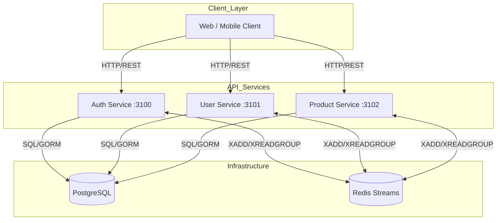
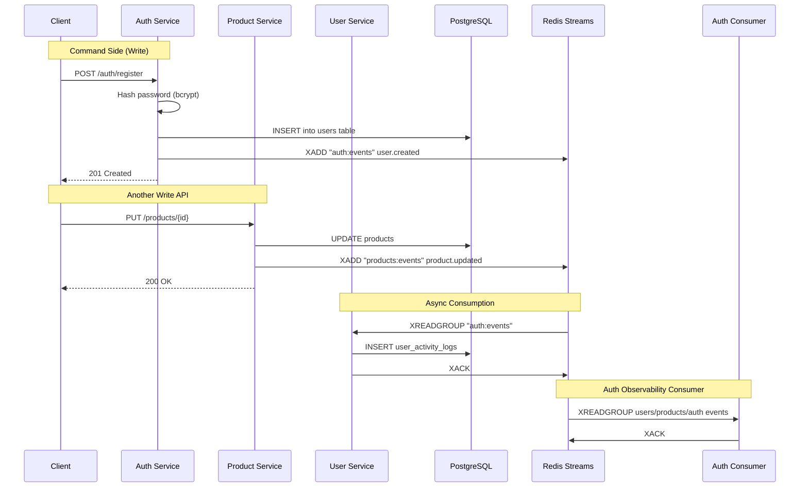

# Go Microservices with Redis Pub/Sub Boilerplate


A production-ready, high-performance microservices starter kit. Built with **Go 1.23+**, **Gin** web framework, **GORM** (PostgreSQL ORM), and **Redis Streams** for event-driven communication.

This boilerplate implements the **Clean Architecture** pattern with strict layer separation (delivery → usecase → repository → domain), and uses **Redis Streams** for lightweight, high-performance asynchronous inter-service communication.

---

## Table of Contents

- [Features](#-features)
- [System Architecture](#-system-architecture)
- [Project Structure](#-project-structure)
- [Prerequisites](#-prerequisites)
- [Getting Started](#-getting-started)
  - [1. Clone & Install](#1-clone--install)
  - [2. Environment Configuration](#2-environment-configuration)
  - [3. Start Infrastructure](#3-start-infrastructure-redis--postgres)
  - [4. Database Setup](#4-database-setup)
  - [5. Run Services](#5-run-services)
- [API Documentation](#-api-documentation)
- [Development](#-development)
- [Git Hooks](#-git-hooks)
- [Testing](#-testing)
- [Redis Streams & Events](#-redis-streams--events)
- [Monitoring](#-monitoring)
- [Deployment](#-deployment)
- [Troubleshooting](#-troubleshooting)
- [Standards & Best Practices](#-standards--best-practices)
- [License](#-license)

---

## Features

- **Microservices Architecture**: Independent services for Auth, User, and Product domains.
- **Event-Driven**: Asynchronous communication via Redis Streams (durable, in-memory log).
- **Clean Architecture**: Strict layer separation with dependency inversion.
- **High Performance**: Built on Go with Gin (ultrafast HTTP framework).
- **Type Safety**: Full Go type system with compile-time checks.
- **Modern ORM**: GORM for type-safe SQL queries and auto-migrations.
- **Soft Delete**: Paranoid mode for safe data recovery.
- **Authentication**: JWT (Stateless) for API access with bcrypt password hashing.
- **Structured Logging**: Zap logger with context-aware logging.
- **Graceful Shutdown**: Zero-downtime deployments with signal handling.
- **Health Checks**: Kubernetes-ready liveness and readiness probes.
- **Metrics**: Prometheus metrics for monitoring.
- **Rate Limiting**: Redis-backed distributed rate limiting.
- **Circuit Breaker**: Sony gobreaker for resilience.
- **Hot Reload**: Air for development with live reload.
- **Wire DI**: Google Wire for compile-time dependency injection.

---

## System Architecture

### High-Level Overview



### Event-Driven Flow

Write APIs persist data first, then publish a domain event to Redis Streams. Consumers process events asynchronously using dedicated consumer groups per service.



### Clean Architecture Layers

```
┌─────────────────────────────────────────────────────────────────────────┐
│                      DELIVERY LAYER (HTTP)                              │
│  Gin handlers, middleware, routes, request/response binding             │
│  Files: delivery/handler.go, delivery/routes.go                        │
├─────────────────────────────────────────────────────────────────────────┤
│                      USECASE LAYER (Business Logic)                     │
│  Application services, orchestration, domain events                     │
│  Files: usecase/service.go, usecase/interfaces.go                       │
├─────────────────────────────────────────────────────────────────────────┤
│                      REPOSITORY LAYER (Data Access)                     │
│  Database operations, external API calls, cache access                  │
│  Files: repository/repository.go, repository/interfaces.go              │
├─────────────────────────────────────────────────────────────────────────┤
│                      DOMAIN LAYER (Core)                                │
│  Entities, value objects, business rules, domain events                 │
│  Files: domain/entity.go, domain/value_objects.go                       │
└─────────────────────────────────────────────────────────────────────────┘
```

### Why Redis Streams?

| Feature              | Redis Streams                    | Kafka                          |
| :------------------- | :------------------------------- | :----------------------------- |
| **Setup Complexity** | Simple (single container)        | Complex (Zookeeper + Kafka)    |
| **Latency**          | Sub-millisecond                  | Milliseconds                   |
| **Memory Usage**     | Low (in-memory)                  | High (disk-based)              |
| **Persistence**      | Optional (AOF/RDB)               | Strong (log compaction)        |
| **Consumer Groups**  | Native support                   | Native support                 |
| **Best For**         | Lighter workloads, simpler setup | High throughput, strong durability |

**Choose this boilerplate if:**
- You want simpler infrastructure setup
- Lower latency is critical
- Your event volume is moderate (< 100K events/sec)
- You prefer Redis for both caching and messaging

---

## Project Structure

```bash
go-microservices-redis-pubsub-boilerplate/
├── cmd/                              # Main entry points (one per service)
│   ├── auth-service/
│   │   ├── main.go                   # Entry point
│   │   ├── wire.go                   # Wire dependency injection
│   │   └── wire_gen.go               # Generated wire code
│   ├── user-service/
│   │   ├── main.go
│   │   ├── wire.go
│   │   └── wire_gen.go
│   └── product-service/
│       ├── main.go
│       ├── wire.go
│       └── wire_gen.go
├── internal/                         # Private business logic
│   ├── auth/                         # Auth bounded context
│   │   ├── domain/                   # Entities, value objects
│   │   │   ├── user.go               # User entity
│   │   │   └── session.go            # Session entity
│   │   ├── dto/                      # Data Transfer Objects
│   │   │   ├── request.go            # Request DTOs
│   │   │   └── response.go           # Response DTOs
│   │   ├── repository/               # Data access interfaces & implementations
│   │   │   ├── user_repository.go
│   │   │   └── session_repository.go
│   │   ├── usecase/                  # Business logic
│   │   │   ├── auth_usecase.go       # Auth business logic
│   │   │   └── interfaces.go         # Interface definitions
│   │   └── delivery/                 # HTTP handlers
│   │       ├── handler.go            # Gin handlers
│   │       └── routes.go             # Route definitions
│   ├── user/                         # User bounded context
│   │   ├── domain/
│   │   ├── dto/
│   │   ├── repository/
│   │   ├── usecase/
│   │   └── delivery/
│   └── product/                      # Product bounded context
│       ├── domain/
│       ├── dto/
│       ├── repository/
│       ├── usecase/
│       └── delivery/
├── pkg/                              # Public shared libraries
│   ├── config/                       # Configuration (Viper)
│   │   └── config.go                 # Config struct & loader
│   ├── database/                     # PostgreSQL & Redis connections
│   │   ├── postgres.go               # GORM connection
│   │   └── redis.go                  # Redis client
│   ├── eventbus/                     # Redis Streams abstraction
│   │   ├── producer.go               # Stream producer (XADD)
│   │   ├── consumer.go               # Stream consumer (XREADGROUP)
│   │   └── event.go                  # Event structure
│   ├── logger/                       # Structured logging (Zap)
│   │   └── logger.go                 # Zap logger setup
│   ├── metrics/                      # Prometheus metrics
│   │   └── metrics.go                # Metrics definitions
│   ├── middleware/                   # HTTP middleware
│   │   ├── auth.go                   # JWT middleware
│   │   ├── ratelimit.go              # Rate limiting (Redis)
│   │   ├── logging.go                # Request logging
│   │   └── cors.go                   # CORS handling
│   ├── resilience/                   # Circuit breaker, retry
│   │   └── circuit_breaker.go        # Sony gobreaker wrapper
│   ├── server/                       # HTTP server utilities
│   │   └── server.go                 # Graceful shutdown
│   └── utils/                        # Common utilities
│       ├── hash.go                   # Bcrypt utilities
│       └── jwt.go                    # JWT utilities
├── deployments/                      # Infrastructure
│   ├── docker/                       # Dockerfiles
│   │   ├── Dockerfile.auth
│   │   ├── Dockerfile.user
│   │   └── Dockerfile.product
│   ├── docker-compose.yml            # Local development
│   └── monitoring/                   # Prometheus/Grafana configs
│       ├── prometheus.yml
│       └── grafana/
├── configs/                          # Configuration files
│   ├── local.yaml                    # Auth service config
│   ├── user-local.yaml               # User service config
│   └── product-local.yaml            # Product service config
├── scripts/                          # Build and utility scripts
│   └── init-db.sql                   # Database initialization
├── test/                             # Test utilities
│   ├── mocks/                        # Generated mocks
│   └── integration/                  # Integration tests
├── docs/                             # Documentation
│   ├── standardization/              # Code style guides
│   │   ├── CODE_STYLE.md
│   │   ├── GORM_BEST_PRACTICES.md
│   │   └── PARANOID_FUNCTIONALITY.md
│   └── update-code-plan/             # Implementation plans
├── go.mod                            # Go module definition
├── go.sum                            # Go module checksums
├── Makefile                          # Build automation
├── .air.toml                         # Hot reload config
├── .golangci.yml                     # Linter config
├── .mockery.yaml                     # Mock generation config
└── .env.example                      # Environment template
```

---

## Prerequisites

Before you begin, ensure you have the following installed:

### Required

1. **Go** (v1.23 or later)
   ```bash
   # macOS
   brew install go

   # Linux
   wget https://go.dev/dl/go1.23.0.linux-amd64.tar.gz
   sudo tar -C /usr/local -xzf go1.23.0.linux-amd64.tar.gz

   # Verify
   go version
   ```

2. **Docker & Docker Compose** (For running Redis and PostgreSQL)
   ```bash
   # macOS
   brew install docker docker-compose

   # Verify
   docker --version
   docker-compose --version
   ```

3. **Make** (For running Makefile commands)
   ```bash
   # macOS (usually pre-installed)
   # Linux
   sudo apt install build-essential
   ```

4. **PostgreSQL** (local or Docker)

### Optional (Recommended)

5. **Air** (Hot reload for development)
   ```bash
   go install github.com/air-verse/air@latest
   ```

6. **Wire** (Dependency injection code generation)
   ```bash
   go install github.com/google/wire/cmd/wire@latest
   ```

7. **golangci-lint** (For linting)
   ```bash
   go install github.com/golangci/golangci-lint/cmd/golangci-lint@latest
   ```

8. **Mockery** (For mock generation)
   ```bash
   go install github.com/vektra/mockery/v2@latest
   ```

---

## Getting Started

Follow these steps strictly to get the boilerplate running locally.

### 1. Clone & Install

```bash
git clone https://github.com/yourusername/go-microservices-redis-pubsub-boilerplate.git
cd go-microservices-redis-pubsub-boilerplate

# Download dependencies
make deps

# Generate Wire dependency injection code
make wire

# Or manually
go mod download
go mod tidy
wire gen ./cmd/...
```

### 2. Environment Configuration

Copy the example environment file and configure:

```bash
cp .env.example .env
```

**Critical Variables Explained:**

| Variable                | Description                           | Default                          |
| :---------------------- | :------------------------------------ | :------------------------------- |
| `APP_NAME`              | Application name                      | `auth-service`                   |
| `APP_ENV`               | Environment (local, staging, prod)    | `local`                          |
| `SERVER_PORT`           | HTTP server port                      | `3100` (auth), `3101` (user), `3102` (product) |
| `DB_HOST`               | PostgreSQL host                       | `localhost`                      |
| `DB_PORT`               | PostgreSQL port                       | `5432`                           |
| `DB_USER`               | Database user                         | `postgres`                       |
| `DB_PASSWORD`           | Database password                     | `postgres`                       |
| `DB_NAME`               | Database name                         | `auth_db` / `user_db` / `product_db` |
| `REDIS_HOST`            | Redis host                            | `localhost`                      |
| `REDIS_PORT`            | Redis port                            | `6379`                           |
| `REDIS_PASSWORD`        | Redis password (if any)               | *(empty)*                        |
| `STREAMS_CONSUMER_GROUP`| Consumer group name                   | Set per service in `configs/*.yaml` |
| `JWT_SECRET`            | Secret key for signing JWT tokens     | **Change in production!**        |
| `JWT_EXPIRES_IN`        | Access token expiration               | `24h`                            |
| `LOG_LEVEL`             | Logging level (debug, info, warn)     | `debug`                          |
| `METRICS_ENABLED`       | Enable Prometheus metrics             | `true`                           |

For local multi-service runs, keep `STREAMS_CONSUMER_GROUP` and `STREAMS_CONSUMER_NAME` service-specific in `configs/local.yaml`, `configs/user-local.yaml`, and `configs/product-local.yaml` to avoid consumer-group collisions.

### 3. Start Infrastructure (Redis & Postgres)

Start the required infrastructure using Docker:

```bash
# Start PostgreSQL and Redis
make docker-up

# Or with docker-compose directly
docker-compose -f deployments/docker-compose.yml up -d postgres redis
```

**Verify services are running:**

```bash
docker ps

# Expected containers:
# - postgres
# - redis
```

**Test Redis connection:**

```bash
docker exec -it go-microservices-redis redis-cli ping
# Expected: PONG
```

### 4. Database Setup

Create databases and run migrations:

```bash
# Create databases (PostgreSQL)
docker exec -it go-microservices-postgres psql -U postgres -c "CREATE DATABASE auth_db;"
docker exec -it go-microservices-postgres psql -U postgres -c "CREATE DATABASE user_db;"
docker exec -it go-microservices-postgres psql -U postgres -c "CREATE DATABASE product_db;"

# Or use the init script
make db-init
```

**Note:** GORM auto-migration will create tables when each service starts for the first time.

### 5. Run Services

You can run services individually in separate terminals:

**Terminal 1 - Auth Service:**
```bash
make run-auth-service
# or: go run ./cmd/auth-service
# Service runs at http://localhost:3100
```

**Terminal 2 - User Service:**
```bash
make run-user-service
# or: go run ./cmd/user-service
# Service runs at http://localhost:3101
```

**Terminal 3 - Product Service:**
```bash
make run-product-service
# or: go run ./cmd/product-service
# Service runs at http://localhost:3102
```

**Or run with hot reload (recommended for development):**

```bash
# Install Air first (if not already)
go install github.com/air-verse/air@latest

# Run with hot reload
make dev
```

---

## API Documentation

### Service Endpoints

| Service     | Port | Base URL                | Health Check              |
| :---------- | :--- | :---------------------- | :------------------------ |
| **Auth**    | 3100 | `http://localhost:3100` | `/health`, `/ready`, `/live` |
| **User**    | 3101 | `http://localhost:3101` | `/health`, `/ready`, `/live` |
| **Product** | 3102 | `http://localhost:3102` | `/health`, `/ready`, `/live` |

### Auth Service Endpoints

| Method | Endpoint          | Description              | Auth Required |
| :----- | :---------------- | :----------------------- | :------------ |
| POST   | `/auth/register`  | Register new user        | No            |
| POST   | `/auth/login`     | Login user               | No            |
| POST   | `/auth/refresh`   | Refresh access token     | No            |
| POST   | `/auth/logout`    | Logout user              | Yes           |
| GET    | `/auth/me`        | Get current user         | Yes           |
| GET    | `/health`         | Health check             | No            |

### User Service Endpoints

| Method | Endpoint                | Description              | Auth Required |
| :----- | :---------------------- | :----------------------- | :------------ |
| GET    | `/api/v1/users`         | List users (paginated)   | Yes           |
| GET    | `/api/v1/users/:id`     | Get user by ID           | Yes           |
| PUT    | `/api/v1/users/:id`     | Update user              | Yes           |
| DELETE | `/api/v1/users/:id`     | Delete user (soft)       | Yes           |
| POST   | `/api/v1/users/:id/restore` | Restore deleted user | Yes           |
| GET    | `/internal/v1/users/:id`| Internal user lookup     | Basic Auth    |

### Product Service Endpoints

| Method | Endpoint              | Description              | Auth Required |
| :----- | :-------------------- | :----------------------- | :------------ |
| GET    | `/products`           | List products            | No            |
| GET    | `/products/:id`       | Get product by ID        | No            |
| POST   | `/products`           | Create product           | Yes           |
| PUT    | `/products/:id`       | Update product           | Yes           |
| DELETE | `/products/:id`       | Delete product (soft)    | Yes           |
| PUT    | `/products/:id/stock` | Update stock quantity    | Yes           |

### Quick API Testing

```bash
# Register a new user
curl -X POST http://localhost:3100/auth/register \
  -H "Content-Type: application/json" \
  -d '{
    "email": "user@example.com",
    "password": "Password123!",
    "name": "Test User"
  }'

# Login
curl -X POST http://localhost:3100/auth/login \
  -H "Content-Type: application/json" \
  -d '{
    "email": "user@example.com",
    "password": "Password123!"
  }'

# Get current user (replace TOKEN with actual JWT)
curl http://localhost:3100/auth/me \
  -H "Authorization: Bearer TOKEN"

# Create a product
curl -X POST http://localhost:3102/products \
  -H "Content-Type: application/json" \
  -H "Authorization: Bearer TOKEN" \
  -d '{
    "name": "Product Name",
    "description": "Product Description",
    "price": 99.99,
    "stock": 100,
    "sku": "SKU-001"
  }'
```

---

## Development

### Available Make Commands

```bash
make help              # Show all available commands
```

| Command                | Description                                    |
| :--------------------- | :--------------------------------------------- |
| **Building**           |                                                |
| `make build`           | Build all services                             |
| `make build-auth-service` | Build auth service only                     |
| `make build-user-service` | Build user service only                     |
| `make build-product-service` | Build product service only               |
| `make build-prod`      | Build for production (optimized)               |
| **Running**            |                                                |
| `make run-auth-service` | Run auth service                              |
| `make run-user-service` | Run user service                              |
| `make run-product-service` | Run product service                         |
| `make dev`             | Run with hot reload (Air)                      |
| **Testing**            |                                                |
| `make test`            | Run all tests with race detector               |
| `make test-coverage`   | Run tests with coverage report (business logic) |
| `make test-integration`| Run integration tests                          |
| **Code Quality**       |                                                |
| `make fmt`             | Format Go code                                 |
| `make vet`             | Run go vet                                     |
| `make lint`            | Run golangci-lint                              |
| `make lint-fix`        | Run linters with auto-fix                      |
| `make security`        | Check for vulnerabilities (govulncheck)        |
| **Dependencies**       |                                                |
| `make deps`            | Download and tidy dependencies                 |
| `make update-deps`     | Update all dependencies                        |
| `make verify-deps`     | Verify dependencies                            |
| **Code Generation**    |                                                |
| `make wire`            | Generate Wire dependency injection             |
| `make mocks`           | Generate mock files using mockery              |
| `make swagger`         | Generate Swagger documentation                 |
| **Docker**             |                                                |
| `make docker-up`       | Start Docker containers                        |
| `make docker-down`     | Stop Docker containers                         |
| `make docker-build`    | Build Docker images                            |
| `make docker-build-prod` | Build production Docker images               |
| `make docker-logs`     | View Docker container logs                     |
| **Database**           |                                                |
| `make db-init`         | Initialize databases                           |
| `make db-drop`         | Drop all databases                             |
| `make db-reset`        | Reset all databases                            |
| **Cleanup**            |                                                |
| `make clean`           | Clean build artifacts                          |
| `make clean-coverage`  | Clean only coverage files                      |
| `make deep-clean`      | Deep clean (including cache)                   |
| **Git Hooks**          |                                                |
| `make install-hooks`   | Install Git hooks (pre-commit, commit-msg)     |

### Hot Reload with Air

The project includes Air configuration (`.air.toml`) for development:

```bash
# Install Air
go install github.com/air-verse/air@latest

# Run with hot reload
make dev

# Air will:
# - Watch for file changes
# - Rebuild on changes
# - Restart the service automatically
```

### Wire Dependency Injection

This project uses Google Wire for compile-time dependency injection:

```bash
# Generate Wire code
make wire

# Wire generates wire_gen.go files in each cmd/*/ directory
```

**Example wire.go:**

```go
//go:build wireinject

package main

import (
    "github.com/google/wire"
)

func InitializeAuthService() (*AuthService, error) {
    wire.Build(
        NewConfig,
        NewDatabase,
        NewRedisClient,
        NewUserRepository,
        NewAuthUsecase,
        NewAuthHandler,
        NewAuthService,
    )
    return nil, nil
}
```

### Code Generation

```bash
# Generate mocks for testing
make mocks

# Generate Swagger documentation (outputs to cmd/*/docs/)
make swagger

# Generate Wire DI code
make wire
```

**Swagger Output:** Each service generates its own Swagger docs in `cmd/{service}/docs/`:
- `cmd/auth-service/docs/` - Auth service API docs
- `cmd/user-service/docs/` - User service API docs
- `cmd/product-service/docs/` - Product service API docs

Access via: `http://localhost:{port}/swagger/index.html`

---

## Git Hooks

This project includes Git hooks to ensure code quality before every commit.

### Installation

After cloning the repository, install the Git hooks:

```bash
# Install Git hooks
make install-hooks

# Or manually
chmod +x .githooks/pre-commit .githooks/commit-msg
git config core.hooksPath .githooks
```

### What the Hooks Do

#### Pre-Commit Hook

Runs automatically before every commit:

1. **gofmt** - Formats all staged Go files
2. **go vet** - Checks for suspicious code constructs
3. **golangci-lint** - Runs comprehensive linting (if installed)

#### Commit-Message Hook

Validates commit message format to maintain a clean git history.

### Commit Message Format

All commit messages must follow this format:

```
<type>: <description>
```

Or with a scope:

```
<type>(scope): <description>
```

**Allowed Types:**

| Type       | Description                              | Example                              |
| :--------- | :--------------------------------------- | :----------------------------------- |
| `add`      | Add new feature                          | `add: user authentication endpoint`  |
| `update`   | Update existing feature                  | `update: improve password hashing`   |
| `fix`      | Bug fix                                  | `fix: resolve database timeout`      |
| `feat`     | New feature (alias for add)              | `feat: add pagination support`       |
| `refactor` | Code refactoring                         | `refactor: simplify auth logic`      |
| `docs`     | Documentation changes                    | `docs: update API documentation`     |
| `test`     | Adding/updating tests                    | `test: add unit tests for auth`      |
| `chore`    | Maintenance tasks                        | `chore: update dependencies`         |
| `style`    | Code style changes (formatting)          | `style: fix formatting issues`       |
| `perf`     | Performance improvements                 | `perf: optimize database queries`    |
| `ci`       | CI/CD changes                            | `ci: add GitHub Actions workflow`    |
| `build`    | Build system changes                     | `build: update Docker configuration` |
| `revert`   | Revert previous commit                   | `revert: undo auth changes`          |

### Troubleshooting Commit Errors

| Error                                  | Cause                              | Solution                                              |
| :------------------------------------- | :--------------------------------- | :---------------------------------------------------- |
| **"Commit message format is invalid!"** | Message doesn't match pattern      | Use format: `type: description` (e.g., `fix: resolve timeout`) |
| **gofmt found issues**                 | Code not formatted                 | Run `make fmt` or let the hook auto-format           |
| **go vet found issues**                | Suspicious code constructs         | Fix the reported issues and try again                |
| **golangci-lint failed**               | Linting errors detected            | Run `make lint-fix` to auto-fix, or fix manually     |
| **Hook not running**                   | Hooks not installed                | Run `make install-hooks`                             |
| **Permission denied**                  | Hook scripts not executable        | Run `chmod +x .githooks/*`                           |

### Bypassing Hooks (Emergency Only)

If you absolutely must bypass the hooks (not recommended):

```bash
# Skip pre-commit and commit-msg hooks
git commit --no-verify -m "emergency fix"

# Or temporarily disable
git config core.hooksPath /dev/null
```

> **Warning:** Only use `--no-verify` in emergencies. Always run `make lint` and `make test` before pushing.

---

## Testing

### Run Tests

```bash
# Run all unit tests with race detector
make test

# Run with coverage (filtered for business logic)
make test-coverage

# Run specific package tests
go test -v ./internal/auth/...

# Run integration tests
make test-integration
```

### Test Coverage

The `make test-coverage` command automatically filters out mocks, domain structs, and DTOs to give a true reflection of your business logic test coverage:

```bash
make test-coverage

# Output:
# total: (statements) 85.2%
# Coverage report generated: coverage.html (Business Logic Only)
```

### Table-Driven Tests

This project follows Go's table-driven test pattern:

```go
func TestAuthService_Register(t *testing.T) {
    tests := []struct {
        name    string
        input   dto.RegisterRequest
        wantErr bool
        errMsg  string
    }{
        {
            name: "successful registration",
            input: dto.RegisterRequest{
                Email:    "test@example.com",
                Password: "Password123!",
                Name:     "Test User",
            },
            wantErr: false,
        },
        {
            name: "duplicate email",
            input: dto.RegisterRequest{
                Email:    "existing@example.com",
                Password: "Password123!",
                Name:     "Test User",
            },
            wantErr: true,
            errMsg:  "email already exists",
        },
        {
            name: "invalid email format",
            input: dto.RegisterRequest{
                Email:    "invalid-email",
                Password: "Password123!",
                Name:     "Test User",
            },
            wantErr: true,
            errMsg:  "invalid email format",
        },
    }

    for _, tt := range tests {
        t.Run(tt.name, func(t *testing.T) {
            // Arrange
            mockRepo := mocks.NewUserRepository(t)
            svc := NewAuthService(mockRepo)

            // Act
            result, err := svc.Register(context.Background(), tt.input)

            // Assert
            if tt.wantErr {
                assert.Error(t, err)
                assert.Contains(t, err.Error(), tt.errMsg)
            } else {
                assert.NoError(t, err)
                assert.NotNil(t, result)
            }
        })
    }
}
```

### Test Structure

```
internal/
├── auth/
│   ├── repository/
│   │   ├── user_repository_test.go
│   │   └── mocks/
│   │       └── UserRepository.go
│   └── usecase/
│       └── auth_usecase_test.go
├── user/
│   └── usecase/
│       └── user_usecase_test.go
└── product/
    └── usecase/
        └── product_usecase_test.go
```

---

## Redis Streams & Events

### Stream Names

| Stream             | Description                          | Producer      | Consumer      |
| :----------------- | :----------------------------------- | :------------ | :------------ |
| `auth:events`      | Auth + user lifecycle events from auth APIs | Auth Service | User Service, Auth Service |
| `users:events`     | User lifecycle events from user APIs | User Service | Auth Service |
| `products:events`  | Product lifecycle events             | Product Service | Auth Service |

### Event Structure

```json
{
  "id": "6f7d9b0c-4d42-4b48-90d9-f58f329830d1",
  "type": "user.created",
  "source": "auth-service",
  "timestamp": 1699999999000,
  "payload": {
    "user_id": "123",
    "email": "user@example.com",
    "role": "USER"
  },
  "metadata": {
    "correlation_id": "abc-123-def"
  }
}
```

### Event Types

| Event Type          | Stream          | Description                    |
| :------------------ | :-------------- | :----------------------------- |
| `user.created`      | auth:events     | New user registered            |
| `user.updated`      | auth:events     | User updated / password changed |
| `user.deleted`      | auth:events     | User deleted from auth admin   |
| `user.restored`     | auth:events     | User restored from auth admin  |
| `user.logged_in`    | auth:events     | User logged in                 |
| `user.logged_out`   | auth:events     | User logged out                |
| `user.refreshed_token` | auth:events  | Refresh token rotated          |
| `user.deleted`      | users:events    | User deleted/deactivated in user service |
| `user.restored`     | users:events    | User restored/activated in user service |
| `product.created`   | products:events | New product added              |
| `product.updated`   | products:events | Product details updated        |
| `product.deleted`   | products:events | Product deleted                |
| `product.restored`  | products:events | Product restored               |
| `product.stock_updated` | products:events | Product stock changed      |

### Write API -> Event Mapping

| Service | Write API | DB Mutation | Published Event |
| :------ | :-------- | :---------- | :-------------- |
| Auth | `POST /auth/register` | `users` + `user_sessions` insert | `user.created` -> `auth:events` |
| Auth | `POST /auth/login` | `user_sessions` replace + `users.last_login_at` update | `user.logged_in` -> `auth:events` |
| Auth | `POST /auth/logout` | `user_sessions` revoke | `user.logged_out` -> `auth:events` |
| Auth | `POST /auth/refresh` | session rotate | `user.refreshed_token` -> `auth:events` |
| Auth | `POST /auth/change-password` | `users.password_hash` update + sessions revoke | `user.updated` -> `auth:events` |
| Auth | `DELETE /admin/users/:id` | user soft/hard delete | `user.deleted` -> `auth:events` |
| Auth | `POST /admin/users/:id/restore` | user restore | `user.restored` -> `auth:events` |
| User | `POST /api/v1/users/:id/activate` | user restore | `user.restored` -> `users:events` |
| User | `POST /api/v1/users/:id/deactivate` | user soft delete | `user.deleted` -> `users:events` |
| User | `DELETE /api/v1/users/:id` | user soft/hard delete | `user.deleted` -> `users:events` |
| User | `POST /api/v1/users/:id/restore` | user restore | `user.restored` -> `users:events` |
| Product | `POST /products` | product insert | `product.created` -> `products:events` |
| Product | `PUT /products/:id` | product update | `product.updated` -> `products:events` |
| Product | `DELETE /products/:id` | product soft/hard delete | `product.deleted` -> `products:events` |
| Product | `POST /products/:id/restore` | product restore | `product.restored` -> `products:events` |
| Product | `PUT /products/:id/stock` | product stock update | `product.stock_updated` -> `products:events` |

### Redis Streams Commands

```bash
# Connect to Redis CLI
docker exec -it go-microservices-redis redis-cli

# List all streams
XRANGE auth:events - +

# Read from stream (consumer group)
XREADGROUP GROUP service-auth auth-1 STREAMS auth:events >

# Acknowledge message
XACK auth:events service-auth 1700000000000-0

# Get stream info
XINFO STREAM auth:events

# Get consumer group info
XINFO GROUPS auth:events
```

### Consumer Groups

Redis Streams consumer groups provide:
- **Message tracking**: Each message is delivered to only one consumer in the group
- **Acknowledgment**: Messages must be explicitly acknowledged (XACK)
- **Pending entries**: Unacknowledged messages can be reclaimed
- **Fault tolerance**: If a consumer fails, another can claim its pending messages

---

## Monitoring

### Prometheus Metrics

Each service exposes Prometheus metrics at `/metrics`:

```bash
# Auth service metrics
curl http://localhost:3100/metrics

# Available metrics:
# - http_requests_total
# - http_request_duration_seconds
# - redis_stream_messages_produced_total
# - redis_stream_messages_consumed_total
# - db_connections_active
```

### Grafana Dashboards

Start the monitoring stack:

```bash
make docker-monitoring-up

# Grafana available at http://localhost:3000
# Default credentials: admin/admin
```

Pre-configured dashboards:
- **Service Overview**: Request rate, latency, error rate
- **Redis Metrics**: Stream length, consumer lag, memory usage
- **Database Metrics**: Connection pool, query performance

### Health Checks

Each service provides multiple health endpoints:

```bash
# Liveness probe (is the service running?)
curl http://localhost:3100/live

# Readiness probe (is the service ready to accept traffic?)
curl http://localhost:3100/ready

# General health
curl http://localhost:3100/health
```

---

## Deployment

### Docker Build

```bash
# Build all services
make build

# Build production images
make build-prod

# Build Docker images
make docker-build

# Binary outputs in bin/
ls bin/
# auth-service
# user-service
# product-service
```

### Docker Compose (Full Stack)

```bash
# Start all services with Docker Compose
docker-compose -f deployments/docker-compose.yml --profile full up -d
```

### Production Checklist

- [ ] Change `JWT_SECRET` to a secure random string (256+ bits)
- [ ] Set `LOG_FORMAT=json` for structured logging
- [ ] Set `LOG_LEVEL=info` or `warn`
- [ ] Configure proper database credentials
- [ ] Enable TLS/SSL for all services
- [ ] Set up proper secret management (Vault, AWS Secrets Manager)
- [ ] Configure Redis persistence (AOF or RDB)
- [ ] Set up database connection pooling
- [ ] Configure resource limits
- [ ] Set up monitoring and alerting
- [ ] Enable distributed tracing

### Environment-Specific Configuration

```bash
# Local development
APP_ENV=local

# Staging
APP_ENV=staging

# Production
APP_ENV=production
```

### Kubernetes (Future Development)

> **Note:** Kubernetes deployment is planned for future development. The following is a reference for when K8s support is added.

```bash
# Future: Apply Kubernetes manifests
# kubectl apply -f deployments/k8s/

# Future: Kustomize overlays
# kubectl apply -k deployments/k8s/overlays/production
```

---

## Troubleshooting

| Issue                               | Possible Cause                          | Solution                                              |
| :---------------------------------- | :-------------------------------------- | :---------------------------------------------------- |
| **Connection Refused (Redis)**      | Redis container not running             | Run `make docker-up` and check `docker ps`            |
| **Connection Refused (PostgreSQL)** | PostgreSQL not running                  | Start PostgreSQL or run via Docker                    |
| **Relation does not exist**         | Database not created                    | Run `make db-init` to create databases                |
| **401 Unauthorized**                | Invalid or expired JWT token            | Refresh token or login again                          |
| **Consumer group not found**        | Stream doesn't exist yet                | Publish first event or create group manually          |
| **Slow API response**               | Database connection pool exhausted      | Increase `DB_MAX_OPEN_CONNS`                          |
| **Rate limit exceeded**             | Too many requests                       | Wait or increase `RATE_LIMIT_REQUESTS`                |
| **Module not found**                | Dependencies not downloaded             | Run `make deps` or `go mod download`                  |
| **Wire generation failed**          | Wire not installed                      | Run `go install github.com/google/wire/cmd/wire@latest` |
| **Hot reload not working**          | Air not installed                       | Run `go install github.com/air-verse/air@latest`      |
| **Commit blocked by hook**          | Pre-commit checks failed                | See [Git Hooks - Troubleshooting Commit Errors](#troubleshooting-commit-errors) |
| **Invalid commit message**          | Wrong format used                       | Use `type: description` format                        |

### Debug Mode

Enable debug logging:

```bash
# In .env
LOG_LEVEL=debug
LOG_FORMAT=console
```

### Check Redis Status

```bash
# Check Redis is running
docker ps | grep redis

# Test connection
docker exec -it go-microservices-redis redis-cli ping

# Check streams
docker exec -it go-microservices-redis redis-cli KEYS "*:events"

# Monitor Redis commands (real-time)
docker exec -it go-microservices-redis redis-cli MONITOR
```

### Reset Redis Streams

```bash
# Delete all streams (development only!)
docker exec -it go-microservices-redis redis-cli DEL auth:events users:events products:events
```

---

## Standards & Best Practices

This project follows Go best practices and includes detailed documentation:

- [Code Style Guide](docs/standardization/CODE_STYLE.md) - Go formatting conventions
- [GORM Best Practices](docs/standardization/GORM_BEST_PRACTICES.md) - Database patterns
- [Paranoid (Soft Delete) Functionality](docs/standardization/PARANOID_FUNCTIONALITY.md) - Soft delete implementation

### Go Best Practices Applied

- **Error Handling**: Explicit error handling with wrapped errors (`fmt.Errorf("%w", err)`)
- **Context Propagation**: All blocking operations accept `context.Context`
- **Interface Segregation**: Small, focused interfaces
- **Dependency Injection**: Wire for compile-time DI
- **Table-Driven Tests**: Standard Go testing pattern
- **Structured Logging**: Zap logger with context fields
- **Graceful Shutdown**: Signal handling for clean termination

---

## License

This project is licensed under the MIT License.
